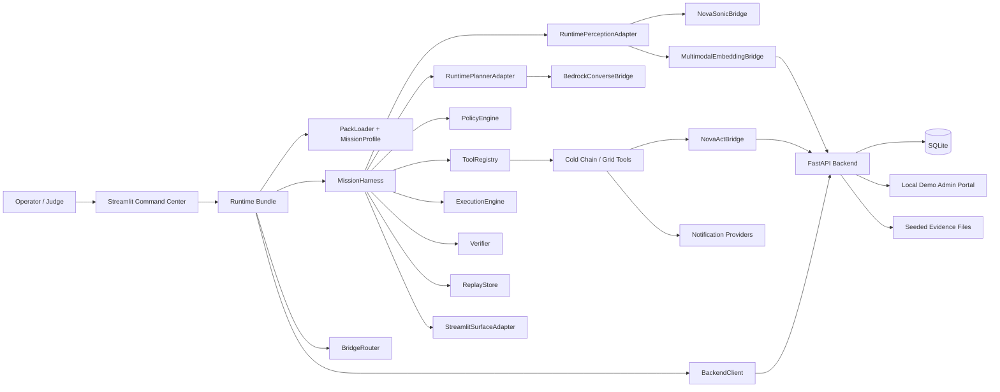
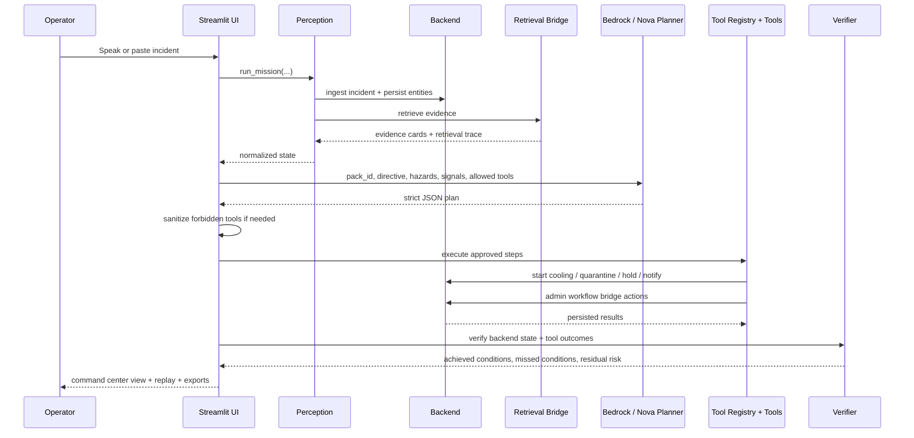

# Nova A.R.C. Command Center

A voice-first, multimodal incident command center built on Amazon Nova.

Nova A.R.C. is a `pack-driven agentic harness` that detects operational incidents, grounds them with evidence, plans the next best actions, executes approved tools, verifies outcomes, and produces a replayable audit trail.

Instead of building a different app for every domain, Nova A.R.C. loads a different `mission pack` and keeps the same runtime:

- same harness
- different directive
- different tools
- different verification rules
- same command-center experience

## Why This Exists

Most AI demos stop at recommendations.

Nova A.R.C. goes further:

1. ingests an incident
2. grounds it with multimodal evidence
3. plans with Amazon Nova
4. executes allowed tools
5. verifies success
6. shows a replay timeline

This makes it suitable for future command-center use cases such as:

- cold-chain / warehouse exception handling
- grid operations incident response
- logistics exception management
- future operations centers that need policy-aware, agentic action loops

## Core Use Case

### ColdChain Live

The primary demo use case is a cold-chain / warehouse exception command center.

Example incident:

> "Zone B temperature is above threshold. Batch VX-204 may be affected. Shipment SHP-884 is loading now."

The system then:

- ingests the incident
- retrieves supporting evidence
- generates a plan
- executes safe actions such as:
  - start backup cooling
  - quarantine batch
  - hold or divert shipment
  - notify on-call
- verifies the result
- produces a replayable incident log

### Grid Ops

A secondary pack proves the harness is reusable across domains with the same runtime but different mission constraints.

## Amazon Nova Usage

Nova A.R.C. is designed around Amazon Nova-native capabilities:

### 1. Amazon Bedrock + Nova Planner

Used for:

- incident reasoning
- strategy generation
- tool-aware planning
- report and replay synthesis

### 2. Amazon Nova 2 Sonic Bridge

Used for:

- voice ingestion
- real-time conversational incident intake
- future live speech workflows

### 3. Amazon Nova Multimodal Embeddings Bridge

Used for:

- evidence retrieval across:
  - SOP documents
  - screenshots / images
  - logs
  - prior incidents

### 4. Amazon Nova Act Bridge

Used for:

- browser workflow automation
- future UI-based command execution against legacy portals

> Current state:
> - `Bedrock` live planner path is real-ready
> - `Nova 2 Sonic` and `Nova Act` are integrated as clean bridge contracts
> - this keeps the harness stable while allowing real backend upgrades later

## Architecture

Nova A.R.C. is implemented as a `mission harness`, not a single-purpose agent.

### Stable Core

- `MissionProfile`
- `PackLoader`
- `MissionHarness`
- `PolicyEngine`
- `ReplayStore`
- `Verifier`
- `ToolRegistry`
- `SurfaceAdapter`

### Replaceable Bridges

- `BedrockConverseBridge`
- `NovaSonicBridge`
- `MultimodalEmbeddingBridge`
- `NovaActBridge`

### Mission Packs

- `cold_chain`
- `grid_ops`

This means future command centers can be configured instead of rewritten.

### High-Level Architecture



## Process Flow

### Mission Execution Flow



### Cold-Chain Demo Storyline

1. Open the command center
2. Use the default cold-chain transcript or speak the same incident
3. Show the retrieved SOP, dashboard, log, and prior incident evidence cards
4. Show the Nova-generated strategy and allowed tools
5. Run the mission and display backend state changes
6. Show verification success and residual risk reduction
7. Export the replay report
8. Switch briefly to the `Grid Ops Proof` pack

## Runtime Modes

The app supports three runtime modes:

### `demo`

Deterministic local behavior for reliable demos and UI testing.

### `live_bedrock`

Uses Amazon Bedrock for live planning and reasoning.

### `live_bridge`

Designed for future external bridge-based execution paths such as Nova Act and Nova 2 Sonic.

## UI Highlights

The Streamlit command center includes:

- mission header
- prime directive
- runtime mode
- model display
- bridge health
- situation overview
- evidence grounding
- planned intervention
- action execution view
- verification panel
- replay timeline
- debug panel with raw planner output

## Hackathon Alignment

The current implementation maps cleanly to the Amazon Nova hackathon categories:

- `Agentic AI`
  - Bedrock Converse generates a structured, pack-scoped plan with tool constraints
- `Multimodal Understanding`
  - retrieval spans documents, screenshots, logs, and prior incidents
- `UI Automation`
  - Nova Act bridge routes safe admin workflows through a local portal
- `Voice AI`
  - Nova Sonic bridge defines the voice-ingress event model and transcript path

## Repository Structure

```text
examples/
  demo.py
  streamlit_app.py
nova_arc/
  adapters/
  backend/
  bridges/
  core/
  packs/
  reporting/
  sample_data/
  tools/
  runtime.py
tests/
scripts/
```

Key entry points:

- `examples/streamlit_app.py` - main command center UI
- `nova_arc/backend/api.py` - FastAPI service and admin portal
- `nova_arc/runtime.py` - runtime assembly and mission execution
- `nova_arc/packs/cold_chain/manifest.yaml` - hero pack definition
- `nova_arc/sample_data/cold_chain/evidence/` - seeded evidence artifacts

## Tools Implemented

### Cold Chain

- `retrieve_evidence`
- `start_backup_cooling`
- `quarantine_batch`
- `hold_shipment`
- `notify_team`

### Grid Ops Proof

- `shed_load`
- `isolate_transformer`
- `dispatch_field_engineer`
- `notify_team`

## Persistence Model

The backend persists the mission state in SQLite using:

- `incidents`
- `batches`
- `shipments`
- `action_log`
- `evidence_sources`

This is what allows the UI to show real state transitions rather than simulated output strings.

## Setup

### Prerequisites

- Python 3.12+
- `uv`
- Optional AWS credentials and Bedrock model access for live planner mode
- Optional Resend or Slack configuration for real notifications

### Environment

Copy `.env.example` to `.env` and fill in the values relevant to your mode.

Important settings:

- `AWS_REGION`
- `NOVA_MODEL_ID`
- `NOVA_SONIC_MODEL_ID`
- `NOVA_EMBEDDINGS_MODEL_ID`
- `AWS_BEARER_TOKEN_BEDROCK` or standard AWS credentials
- `BACKEND_URL`
- `BACKEND_DB_PATH`
- `NOTIFICATION_PROVIDER`
- `SLACK_WEBHOOK_URL`
- `RESEND_API_KEY`
- `RESEND_FROM_EMAIL`
- `RESEND_TO_EMAIL`

### Install With uv

```bash
uv venv
uv pip install -r requirements.txt
```

## Running The System

### Start the backend

```bash
uv run uvicorn nova_arc.backend.api:app --host 127.0.0.1 --port 8000
```

### Start the Streamlit UI

In a second terminal:

```bash
uv run streamlit run examples/streamlit_app.py
```

### Optional Windows shortcut

```powershell
powershell -ExecutionPolicy Bypass -File scripts/start_coldchain_live.ps1
```

### Local demo script

```bash
uv run python examples/demo.py
```

## Notifications

Supported notification paths:

- Slack webhook
- Teams webhook
- Telegram bot
- SMTP email
- Resend email

Recommended for demo stability:

- `Slack` if you want the fastest visible notification path
- `Resend` if you want a cleaner real email story

## Sample Evidence

The cold-chain pack includes seeded evidence for:

- SOP PDF
- dashboard screenshot
- incident log CSV
- prior incident note

The retrieval layer refreshes existing evidence rows when the app starts, so improved snippets and metadata are reflected without manual DB cleanup.

## Testing

Run the full test suite with:

```bash
uv run pytest -q
```

The automated coverage includes:

- planner JSON parsing
- forbidden-tool sanitization
- backend state transitions
- bridge routing by mode
- replay and export output
- pack-scoped tool exposure
- UI helper formatting

## Why This Design

The system is intentionally split between:

- a reusable pack-driven harness
- bridge-compatible Nova integrations
- a persistent backend for visible state change
- a presentation surface optimized for a short filmed demo

That combination makes the project suitable both as a hackathon submission and as a foundation for future domain packs.
