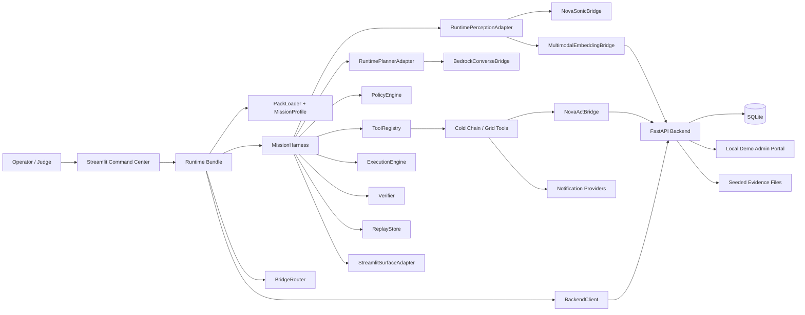
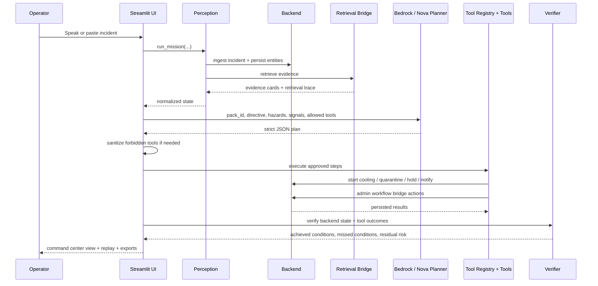

# Nova A.R.C. ColdChain Live

Nova A.R.C. ColdChain Live is a pack-driven incident command center built for the Amazon Nova hackathon. It turns a spoken cold-chain incident into a grounded, policy-aware response: voice intake is normalized, evidence is retrieved, Amazon Nova generates a constrained action plan, tools execute against a real backend, outcomes are verified, and the full mission is replayed in a premium Streamlit interface.

## Executive Summary

This project is designed to feel close to a real operational command center rather than a slideware demo:

- `Amazon Bedrock Runtime` powers the planner through `Converse`
- `Amazon Nova 2 Sonic` is represented through a transcript-first voice ingress bridge
- `Amazon Nova Multimodal Embeddings` is represented through a bridge-compatible retrieval layer over SOPs, screenshots, logs, and prior incidents
- `Amazon Nova Act` is represented through a local admin-portal workflow bridge for browser-style actions
- `FastAPI + SQLite` persist all visible state changes
- `Streamlit` presents the command center, replay, verification, and exports
- `Cold Chain` is the hero pack and `Grid Ops` proves the harness is reusable

## What The System Does

The primary scenario is a warehouse cold-chain incident:

> "Zone B temperature is above threshold. Batch VX-204 may be affected. Shipment SHP-884 is loading now."

From that input, the system:

1. Captures the incident through the Nova Sonic bridge contract
2. Grounds the mission with multimodal evidence
3. Builds a pack-scoped plan with Bedrock Converse
4. Executes real tool actions against a local backend
5. Verifies conditions such as chamber stabilization, batch quarantine, and shipment hold/diversion
6. Produces a replay timeline plus JSON and Markdown exports

## Architecture

### High-Level Architecture



### Core Runtime Abstractions

The project keeps the harness abstractions intact:

- `MissionProfile`
- `PackLoader`
- `MissionHarness`
- `PolicyEngine`
- `ReplayStore`
- `Verifier`
- `ToolRegistry`
- `SurfaceAdapter`

And it preserves the bridge abstractions:

- `BedrockConverseBridge`
- `NovaSonicBridge`
- `MultimodalEmbeddingBridge`
- `NovaActBridge`

## Process Flow

### Mission Execution Flow



### Cold-Chain Demo Storyline

1. Open the command center
2. Use the default cold-chain transcript or speak the same incident
3. Show the retrieved SOP, dashboard, log, and prior incident evidence cards
4. Show the Nova-generated strategy and allowed tools
5. Run the mission and display backend state changes
6. Show verification success and residual risk reduction
7. Export the replay report
8. Switch briefly to the `Grid Ops Proof` pack

## Amazon Nova Alignment

This project is intentionally mapped to the hackathon categories:

- `Agentic AI`
  - Bedrock Converse generates a structured plan with pack-scoped tools
- `Multimodal Understanding`
  - retrieval covers documents, images, logs, and prior incident notes
- `UI Automation`
  - Nova Act bridge routes quarantine and shipment-hold workflows through a local admin portal
- `Voice AI`
  - Nova Sonic bridge defines the voice ingress contract and transcript event stream

## Repository Structure

```text
examples/
  demo.py
  streamlit_app.py
nova_arc/
  adapters/
  backend/
  bridges/
  core/
  packs/
  reporting/
  sample_data/
  tools/
  runtime.py
tests/
scripts/
```

Key entry points:

- `examples/streamlit_app.py` - main command center UI
- `nova_arc/backend/api.py` - FastAPI service and admin portal
- `nova_arc/runtime.py` - runtime assembly and mission execution
- `nova_arc/packs/cold_chain/manifest.yaml` - hero pack definition
- `nova_arc/sample_data/cold_chain/evidence/` - seeded evidence artifacts

## Runtime Modes

- `demo`
  - deterministic planner path with local retrieval and local browser workflow bridge
- `live_bedrock`
  - Bedrock Converse planning with the same backend and UI workflow path
- `live_bridge`
  - live-labeled bridge mode for Bedrock plus Sonic and Nova Act contracts

## Tools Implemented

### Cold Chain

- `retrieve_evidence`
- `start_backup_cooling`
- `quarantine_batch`
- `hold_shipment`
- `notify_team`

### Grid Ops Proof

- `shed_load`
- `isolate_transformer`
- `dispatch_field_engineer`
- `notify_team`

## Persistence Model

The backend persists the mission state in SQLite using:

- `incidents`
- `batches`
- `shipments`
- `action_log`
- `evidence_sources`

This is what allows the UI to show real state transitions rather than simulated output strings.

## Setup

### Prerequisites

- Python 3.12+
- `uv`
- Optional AWS credentials and Bedrock model access for live planner mode
- Optional Resend or Slack configuration for real notifications

### Environment

Copy `.env.example` to `.env` and fill in the values relevant to your mode.

Important settings:

- `AWS_REGION`
- `NOVA_MODEL_ID`
- `NOVA_SONIC_MODEL_ID`
- `NOVA_EMBEDDINGS_MODEL_ID`
- `AWS_BEARER_TOKEN_BEDROCK` or standard AWS credentials
- `BACKEND_URL`
- `BACKEND_DB_PATH`
- `NOTIFICATION_PROVIDER`
- `SLACK_WEBHOOK_URL`
- `RESEND_API_KEY`
- `RESEND_FROM_EMAIL`
- `RESEND_TO_EMAIL`

### Install With uv

```bash
uv venv
uv pip install -r requirements.txt
```

## Running The System

### Start the backend

```bash
uv run uvicorn nova_arc.backend.api:app --host 127.0.0.1 --port 8000
```

### Start the Streamlit UI

In a second terminal:

```bash
uv run streamlit run examples/streamlit_app.py
```

### Optional Windows shortcut

```powershell
powershell -ExecutionPolicy Bypass -File scripts/start_coldchain_live.ps1
```

### Local demo script

```bash
uv run python examples/demo.py
```

## Notifications

Supported notification paths:

- Slack webhook
- Teams webhook
- Telegram bot
- SMTP email
- Resend email

Recommended for demo stability:

- `Slack` if you want the fastest visible notification path
- `Resend` if you want a cleaner real email story

## Sample Evidence

The cold-chain pack includes seeded evidence for:

- SOP PDF
- dashboard screenshot
- incident log CSV
- prior incident note

The retrieval layer refreshes existing evidence rows when the app starts, so improved snippets and metadata are reflected without manual DB cleanup.

## Testing

Run the full test suite with:

```bash
uv run pytest -q
```

The automated coverage includes:

- planner JSON parsing
- forbidden-tool sanitization
- backend state transitions
- bridge routing by mode
- replay and export output
- pack-scoped tool exposure
- UI helper formatting

## Why This Design

The system is intentionally split between:

- a reusable pack-driven harness
- bridge-compatible Nova integrations
- a persistent backend for visible state change
- a presentation surface optimized for a short filmed demo

That combination makes the project suitable both as a hackathon submission and as a foundation for future domain packs.
